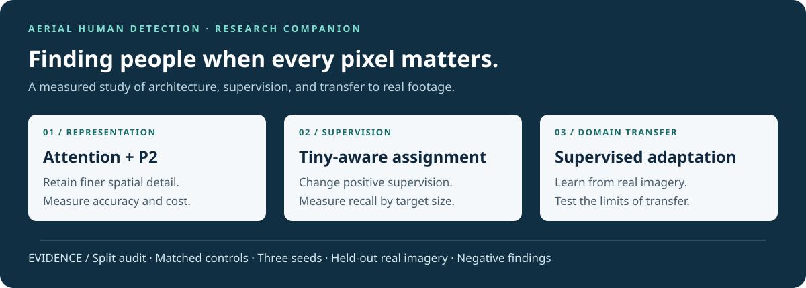
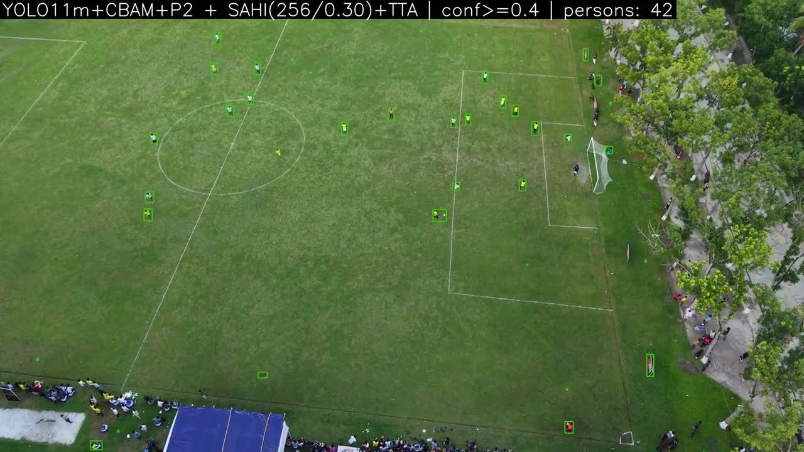
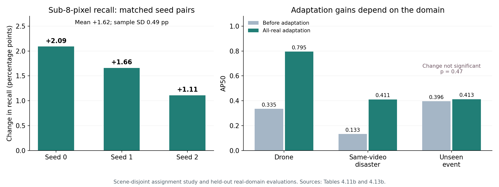
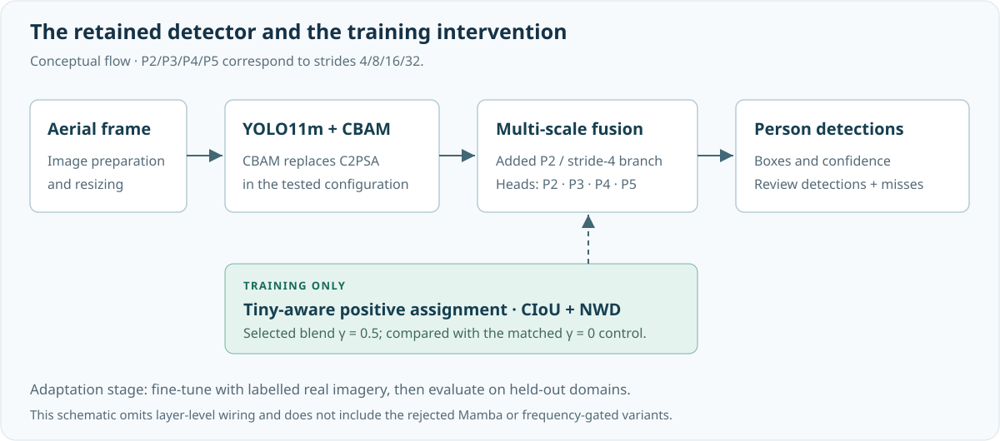

# Tiny Human Detection in Aerial Search-and-Rescue Imagery

**Attention, spatial resolution, and supervision for finding people at the limits of aerial visibility.**



**Md Mofazzal Hosen** · B.Sc. in Computer Science and Engineering  
**Khulna University of Engineering & Technology (KUET), Bangladesh**  
Supervisor: **Prof. Dr. Sk. Md. Masudul Ahsan** · Thesis/project: **CSER-26-88** · September 2026

[Thesis PDF](public-showcase/documents/thesis.pdf) · [Presentation](public-showcase/presentation/README.md) · [Video demos](public-showcase/demos/README.md) · [Results](#results) · [Visual evidence](public-showcase/docs/GALLERY.md) · [Evidence](public-showcase/docs/EVIDENCE.md)

> Research companion to the undergraduate thesis archived under **MSA-YOLO**. Read the report, watch the demonstrations, inspect the exported measurements, or run the independent result checker. This package includes no detector implementation, model weights, or raw datasets. The README covers the completed extended study; the original defense presentation documents the earlier architectural study.

## Explore the work

| Start with | What you can inspect |
|---|---|
| **[Full thesis](public-showcase/documents/thesis.pdf)** | The 88-page final submission report, including references and model-selection history |
| **[Defense presentation](public-showcase/presentation/README.md)** | The original 43-page deck, selected slide previews, and a guide to the later findings |
| **[10 m drone demo](public-showcase/demos/drone-10m.mp4)** | Complete annotated clip using plain CBAM + P2 inference |
| **[50 m drone demo](public-showcase/demos/drone-50m.mp4)** | Complete annotated clip using tiled inference and test-time augmentation |
| **[Comparison and failure gallery](public-showcase/docs/GALLERY.md)** | Improved and regressed cases, plus a severe missed-detection example |
| **[Evidence guide](public-showcase/docs/EVIDENCE.md)** | Table provenance, original bootstrap summaries, and known discrepancies |

[](public-showcase/demos/drone-50m.mp4)

*Own-drone footage, 50 m. Original defense-demo CBAM + P2 with SAHI/TTA at confidence 0.40. Green boxes in this video are predictions, not independently verified true positives. The clip illustrates behaviour; it does not establish the final adapted model's benchmark scores.*


## Research question

**How can an aerial detector recover more extremely small people, and how much of that improvement survives the move from synthetic disaster imagery to real footage?**

People in aerial images may occupy only a handful of pixels, overlap with surrounding clutter, or be partly occluded. A good overall detection score can conceal poor performance on the smallest people. This study therefore examines architectural choices, size-aware supervision, benchmark leakage, and real-domain adaptation together, while reporting the trade-offs between them.

In the official C2A test set, **99.56% of annotated people fall below 32 pixels** and **34.57% below 8 pixels**, using size = √(box width × box height). These are bounding-box scale categories, not person heights. [Counts and matched detections](public-showcase/results/tab_4_5_per_size_recall.csv).

## What the study establishes

| Finding | Evidence | Interpretation |
|---|---|---|
| A practical architectural configuration | CBAM + P2: **0.8533 AP50**, **19.57M parameters**, **86.7 GFLOPs** | A useful accuracy–cost trade-off within the tested official-split ablation |
| A repeatable gain for the smallest people | **+1.62 ± 0.49 percentage points** in sub-8-pixel recall across three seeds | A size-specific recall gain; ± denotes sample standard deviation, not a confidence interval |
| Strong adaptation to the collected drone domain | AP50 **0.3354 → 0.7950** on 60 held-out drone frames | Supervised real-domain adaptation helps substantially |
| A measurable generalization limit | Unseen-event AP50 **0.3957 → 0.4126**, bootstrap **p = 0.47** | Broad cross-disaster robustness is not established |
| Additional complexity can be unhelpful | Mamba variant: **41.1 ms**, versus **14.6 ms** for CBAM + P2 | More computation did not yield a useful overall accuracy gain in this experiment |

Each row is mapped to an exported table or statistical record in the [evidence guide](public-showcase/docs/EVIDENCE.md). Reported latency belongs to its archived measurement protocol; it is not a live-video frame-rate claim.



*Left: paired assignment gains for each seed. Right: source-only versus all-real supervised adaptation. The same-video disaster result and unseen-event result answer different generalization questions.*

## Method

The study separates three interventions so their effects can be examined independently.

1. **Attention and resolution.** Start with YOLO11m, replace C2PSA with CBAM in the tested configuration, and add a P2 detection branch at stride 4. The resulting head predicts at four scales: P2/P3/P4/P5. CBAM replaces an existing component, which explains why the parameter count can decrease despite the added attention mechanism.
2. **Tiny-aware assignment.** On the scene-disjoint benchmark, blend CIoU and normalized Wasserstein distance in the training-time assignment score. The selected blend is γ = 0.5. This changes which predictions receive positive supervision; it adds no inference-time assignment stage. It is distinct from the earlier NWD loss experiment.
3. **Supervised adaptation.** Fine-tune with real drone, campus, and disaster imagery, then evaluate on held-out sets. The headline adaptation result uses labelled real data; it is not evidence for an unsupervised or self-training-only method.



*Conceptual architecture, not a layer-by-layer implementation diagram. The assignment experiment is compared with its matched γ = 0 control. Proposed frequency-gated modules were tested separately and were not retained as a successful contribution.*

The thesis contains the layer-level architecture and assignment equations. For a guided visual explanation, see the [presentation's architecture and P2 slides](public-showcase/presentation/README.md#selected-slides), then read the later assignment study in Chapter 4 of the [report](public-showcase/documents/thesis.pdf).

## Results

### 1. Architectural ablation — official C2A split

The four configurations below were evaluated within the thesis ablation. The official split has background-scene overlap between training and test; these scores must not be merged with the later scene-disjoint results.

| Configuration | Parameters (M) | GFLOPs | AP50 | AP50:95 | Best F2 | Latency (ms) |
|---|---:|---:|---:|---:|---:|---:|
| YOLO11m baseline | 20.03 | 67.7 | 0.8432 | 0.6151 | 0.8399 | 13.7 |
| CBAM | 19.08 | 66.9 | 0.8473 | 0.6161 | 0.8406 | 13.5 |
| **CBAM + P2** | **19.57** | **86.7** | **0.8533** | **0.6153** | **0.8442** | **14.6** |
| Mamba + CBAM + P2 | 22.01 | 98.4 | 0.8521 | 0.6143 | 0.8438 | 41.1 |

[Download the ablation table](public-showcase/results/tab_4_4_additive_ablation.csv). Latency was recorded on the thesis RTX 4070 Ti SUPER workstation. It should not be substituted for measurements of tiled inference, another device, or end-to-end video processing.

CBAM + P2 raises sub-8-pixel recall from **0.7427 to 0.7575** in this ablation: **369 additional matched instances** out of 25,072 very-tiny ground-truth instances. This is an instance count, not 369 distinct people. Recall in some larger size bands decreases. [Per-size counts](public-showcase/results/tab_4_5_per_size_recall.csv).

### 2. Tiny-aware assignment — scene-disjoint C2A split

| Seed | Control recall, <8 px | Assignment recall, <8 px | Change (percentage points) |
|---|---:|---:|---:|
| 0 | 0.7299 | 0.7508 | +2.09 |
| 1 | 0.7337 | 0.7503 | +1.66 |
| 2 | 0.7364 | 0.7475 | +1.11 |
| **Mean ± sample SD of the changes** | — | — | **+1.62 ± 0.49** |

[Three-seed results](public-showcase/results/tab_4_11b_three_seed_replication.csv).

The seed-0 paired bootstrap estimates **+2.08 percentage points**, with a **95% interval of [1.77, 2.38]** and **p < 0.001** over 1,000 resamples of 2,040 test images. The +2.09 entry above comes from the rounded seed-summary values; the bootstrap export reports +2.08. These are two reported summaries of the same pair, not separate experiments.

The improvement is a **reallocation of recall toward the smallest targets**. In the seed-0 comparison, recall changes by −1.15 points at 8–16 px, −0.95 at 16–32 px, and −13.17 at 32–96 px. The last band contains only 410 instances. AP50 is essentially unchanged, and the AP-small/F2 gains do not consistently replicate across seeds. [Full matched-pair table](public-showcase/results/tab_4_11_matched_pair_bootstrap.csv).

### 3. Synthetic-to-real adaptation

| Evaluation domain | Before real-data adaptation: AP50 | Final adaptation: AP50 | Scope of the result |
|---|---:|---:|---|
| Drone, 60 held-out frames | 0.3354 | **0.7950** | Collected drone domain |
| Disaster R-set, 25 frames | 0.1326 | **0.4109** | Held-out frames from source videos also used for training |
| Unseen disaster event, 23 frames | 0.3957 | **0.4126** | +1.69 points; not significant, p = 0.47 |
| C2A scene-disjoint, 2,040 images | 0.8441 | **0.8370** | A source-domain cost of 0.71 points |

[Adaptation stages](public-showcase/results/tab_4_13b_adaptation_stages.csv). The R-set result demonstrates within-video adaptation; temporal separation alone does not establish unseen-event generalization. The unseen-event set is the stronger test of that claim.

The final adapted model was evaluated on five sets:

| Held-out set | Images | Person instances | AP50 | Best F2 | Recall at confidence 0.25 |
|---|---:|---:|---:|---:|---:|
| C2A scene-disjoint | 2,040 | 72,847 | 0.8370 | 0.8239 | 0.8211 |
| Drone | 60 | 3,584 | 0.7950 | 0.7708 | 0.8365 |
| Disaster R-set | 25 | 1,070 | 0.4109 | 0.4715 | 0.4505 |
| Unseen disaster event | 23 | 318 | 0.4126 | 0.4510 | 0.3742 |
| Campus | 25 | 663 | 0.6885 | 0.6657 | 0.7179 |

[Complete table, including precision and calibration](public-showcase/results/tab_4_13_final_model_all_heldout_sets.csv). These domains have different target sizes and scene characteristics; they are not interchangeable tiny-object benchmarks.

## Evaluation protocol

| Item | Meaning in this companion |
|---|---|
| Target class | `person` |
| Official C2A split | 6,129 train / 2,043 validation / 2,043 test images; architectural ablation |
| Scene-disjoint C2A split | 6,135 train / 2,040 validation / 2,040 test images; extended assignment study |
| AP50 | Average precision at IoU 0.50 |
| AP50:95 | COCO-style AP averaged over IoU thresholds 0.50 to 0.95 |
| Size bins | √(w × h): <8, 8–16, 16–32, 32–96, and ≥96 pixels in evaluation coordinates |
| Extended-study per-size recall | Greedy IoU ≥0.5 matching at each model's own F1-optimal threshold |
| Best F2 | Maximum F2 over the evaluated confidence sweep; not F2 at a fixed 0.25 threshold |
| Recall at 0.25 | A separate fixed-confidence operating-point measurement |
| Replication | Three matched seeds for the assignment result; not three seeds for every table |
| Uncertainty | Image-level paired bootstrap; it does not measure between-event uncertainty |

Thresholds selected on the evaluated predictions describe those evaluations; they are not independently validated deployment thresholds. Likewise, the reported bootstrap uses images as resampling units and does not explicitly account for residual correlation between images from the same scene or video.

The leakage audit found substantial background-scene overlap in official C2A. In the archived CBAM + P2 comparison, AP50 falls from **0.8533 to 0.8372** on the scene-disjoint re-split (−1.61 points). This is a comparison under changed split conditions, not a universal correction factor for other models. [Split comparison](public-showcase/results/tab_4_9_scene_leakage_cost.csv).

## Demonstrations and qualitative evidence

This companion includes playable annotated drone videos at **10 m** and **50 m**, together with representative [comparison and failure cases](public-showcase/docs/GALLERY.md). The [demo guide](public-showcase/demos/README.md) records the model mapping, inference settings, source identity, duration, and sharing conversion. The original files remain in the full thesis handover.

Demos show model behaviour on particular clips. Quantitative conclusions come from the held-out evaluations above. Tiling, test-time augmentation, confidence threshold, and checkpoint identity must accompany a public clip; visual playback speed is not an inference-speed measurement.

## Limitations and negative findings

- **No universal detector superiority claim.** Tiny-aware assignment helps the sub-8-pixel group while sacrificing recall elsewhere. Overall AP50/F2 are not consistently improved across seeds.
- **Domain adaptation is not broad robustness.** The large drone gain and within-video R-set gain do not establish transfer to arbitrary disasters.
- **Occlusion remains incompletely isolated.** The task includes occluded people, but the headline tables are not an independently labelled occlusion-stratified benchmark.
- **Mamba and frequency gating did not justify adoption.** Their tested configurations are documented negative/null results, not evidence that all such methods fail.
- **Real evaluations are small and correlated.** Frames from a video are not equivalent to independent disaster events.
- **Archived discrepancies are disclosed.** An older attention-screening table has two ECA values without located primary records; those values are excluded here. The archive also records small counting and protocol-caption discrepancies. See [evidence notes](public-showcase/docs/EVIDENCE.md).

This is a research prototype for human review. The study does not establish reliability for autonomous rescue decisions.

## Inspect the results without the training code

The companion includes selected CSV tables and a small, independent Python script that checks the reported arithmetic. It does not import the detector, load weights, or access the private repository.

```powershell
python public-showcase/analysis/verify_results.py
```

Python 3.10 or newer and the standard library are sufficient. The script verifies the three-seed summary, per-size count consistency, adaptation deltas, and packaged-file hashes. These checks establish consistency of the shared exports; reproducing model training or inference requires the private research artifacts.

```text
README.md              Research narrative and headline findings
documents/             Full thesis PDF
presentation/          Original defense PDF and slide previews
assets/                Diagrams, result chart, and comparison images
results/               Tables, bootstrap summaries, and result manifest
analysis/              Independent result-arithmetic checker
docs/EVIDENCE.md        Table provenance and interpretation notes
docs/GALLERY.md         Measured successes, regressions, and failure cases
docs/AVAILABILITY.md    Public/private artifact boundaries
demos/                 Two complete video demos, posters, and provenance
RELEASE_MANIFEST.json   File sizes and SHA-256 for the complete companion
```

## Attribution and research status

The underlying detector builds on YOLO11/Ultralytics and established attention, multi-scale detection, and distance-based assignment ideas. The contribution presented here is the measured study and its supported findings, not authorship of those underlying methods.

Suggested thesis citation:

> Hosen, Md Mofazzal. *MSA-YOLO: A Multi-Scale Attention Enhancement of YOLO for Tiny-Human Detection in Aerial Search-and-Rescue Imagery*. B.Sc. thesis, Department of Computer Science and Engineering, Khulna University of Engineering & Technology, 2026.

The report's cover records July 2026; this companion was assembled and audited in September 2026. The formal thesis title is retained in the citation and original documents. The descriptive repository title does not assert a unique model name. No DOI or publication acceptance is asserted. See [availability and attribution](public-showcase/docs/AVAILABILITY.md).


## Research workspace navigation

The portable companion is the folder to share when detector source access is not intended. This research workspace also contains the implementation and working history; its repository visibility must be managed separately.

- [Professor guide](pendrive/README.md): complete local handover and portable showcase.
- [Project status](START_HERE.md) and [active lap](27-07-2026-Novelty-Lap-4/README.md).
- [Dataset map](DATA_MAP.md).
- [Showcase audit and release record](docs/2026-09-19_showcase_full_audit.md).

The pendrive links are local-workspace links; that folder is not tracked in the research repository.
