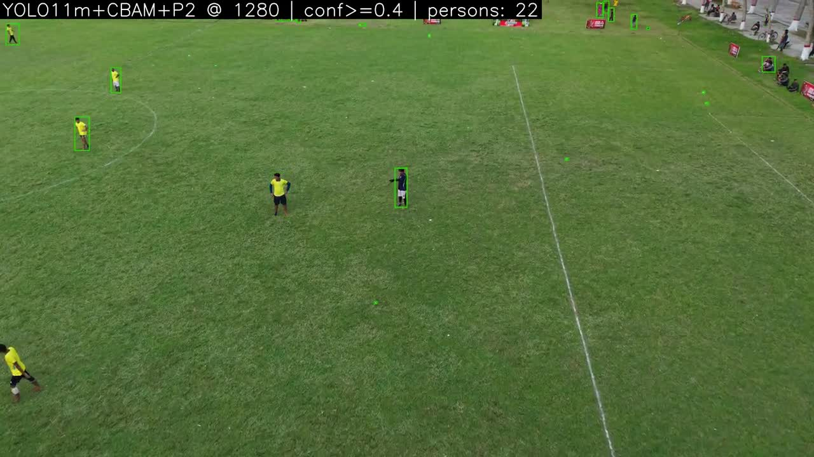

# Drone demos

## 10 m: plain inference

[Watch the clip](drone-10m.mp4) | 33.83 seconds | confidence 0.40

## 50 m: tiled inference and test-time augmentation

[Watch the clip](drone-50m.mp4) | 37.34 seconds | confidence 0.40 | 256-pixel tiles with 30% overlap

Both clips use the earlier CBAM + P2 model, before the final real-data fine-tuning. The model is identified from the archived filename and renderer configuration; a per-video checkpoint hash was not recorded.

Boxes are predictions, not verified ground-truth matches. The inference settings differ, so the clips are not a controlled comparison of flight altitudes.

The files preserve the complete recorded outputs and frame cadence, resized to 1280 x 720 with no audio. Playback frame rate does not measure inference throughput.

[Detection failures](../docs/GALLERY.md) | [Measured held-out results](../results/tab_4_13_final_model_all_heldout_sets.csv) | [File provenance](media.json)
