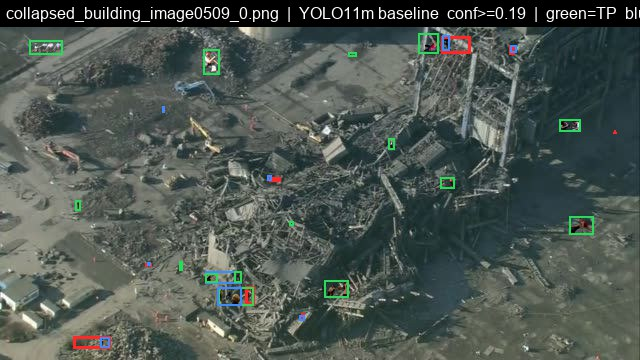
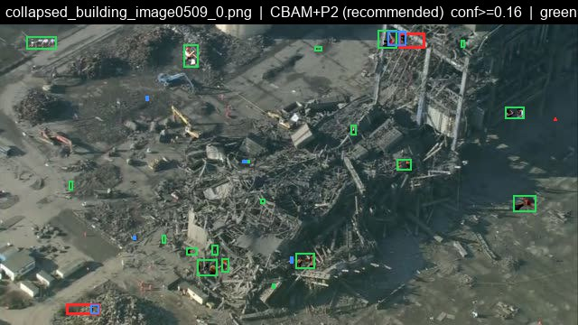
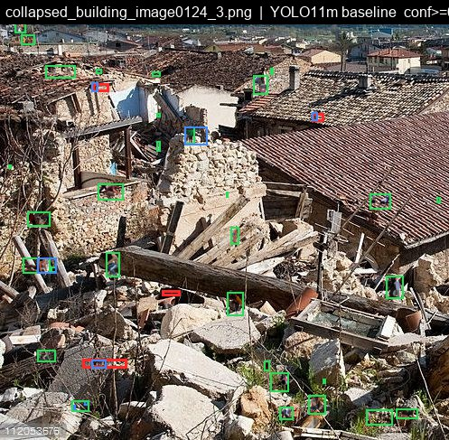
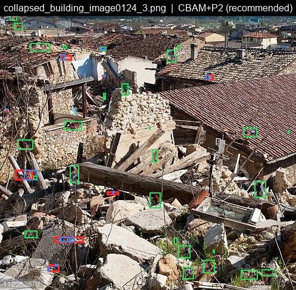
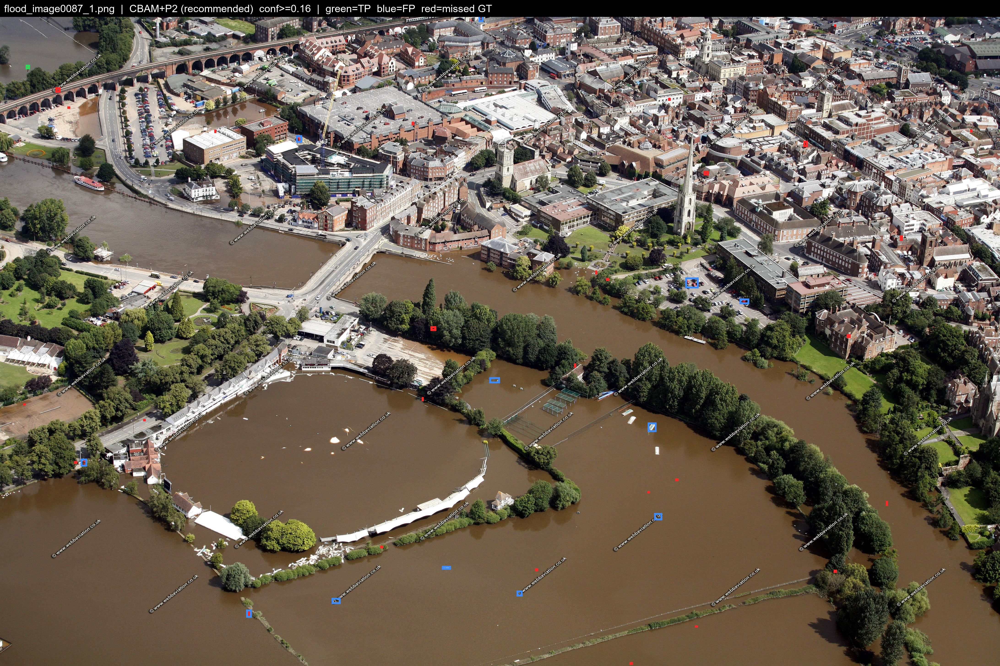

# Detection examples

These C2A examples compare YOLO11m with CBAM + P2. They were selected for large gains, regressions, or low recall, so they do not represent average performance.

Green boxes are matched detections, blue boxes are false positives, and red boxes are missed annotations. Matching uses IoU >= 0.5. The displayed confidence thresholds are 0.19 for the baseline and 0.16 for CBAM + P2.

The [ranking table](../results/failure_and_comparison_cases.csv) uses confidence 0.25. The counts below instead use the [displayed-threshold counts](../results/gallery_overlay_counts.csv), recomputed from cached detections.

## More detections

This image contains 24 annotated people. The baseline matches 15, misses 9, and has 9 false positives. CBAM + P2 matches 20, misses 4, and has 7 false positives. Recall rises from 0.6250 to 0.8333.

| Baseline | CBAM + P2 |
|---|---|
|  |  |

## A regression

This image contains 35 annotated people. The baseline matches 31, misses 4, and has 7 false positives. CBAM + P2 matches 27, misses 8, and has 12 false positives. Recall falls from 0.8857 to 0.7714.

| Baseline | CBAM + P2 |
|---|---|
|  |  |

## Most people missed

Of 30 annotated people, CBAM + P2 matches 1 and misses 29, with 12 false positives at confidence 0.16. Recall is 0.0333. The ranking table's zero matches and six false positives use the different 0.25 threshold.

These are existing outputs; no new inference was run for this page. The underlying images are from C2A by Nihal et al. [Credits](AVAILABILITY.md).
