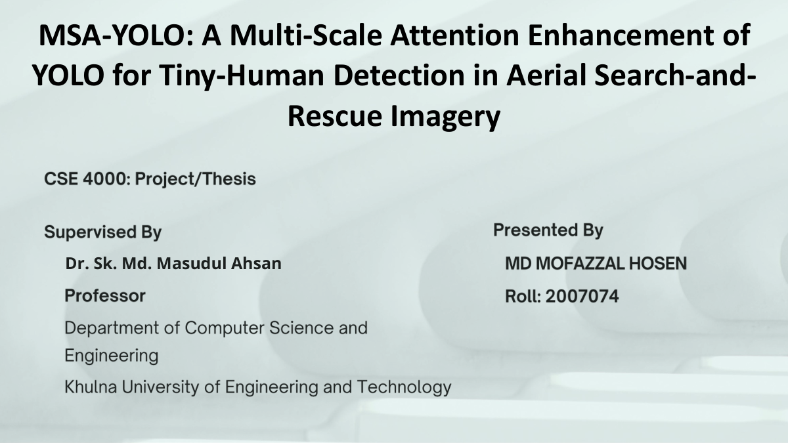
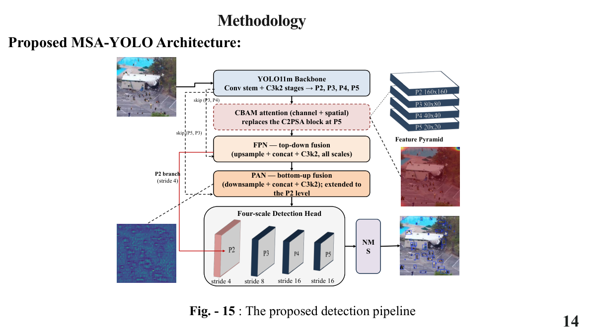
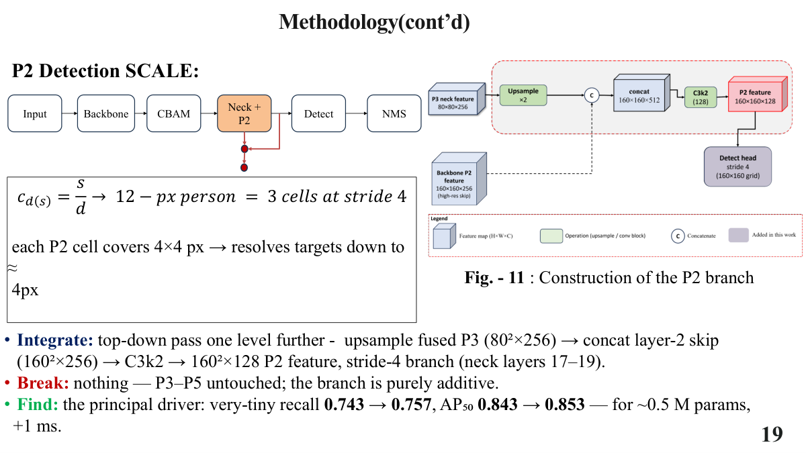
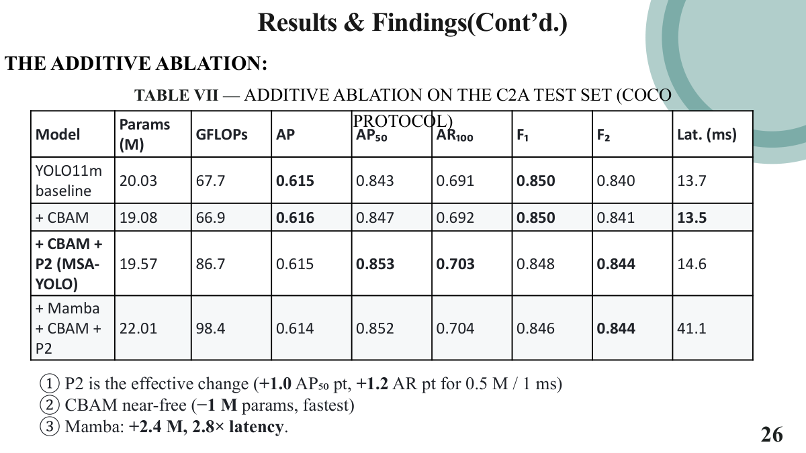
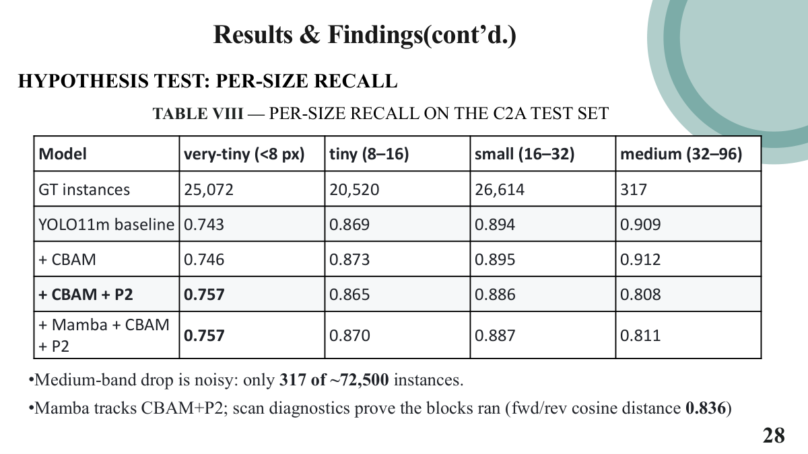
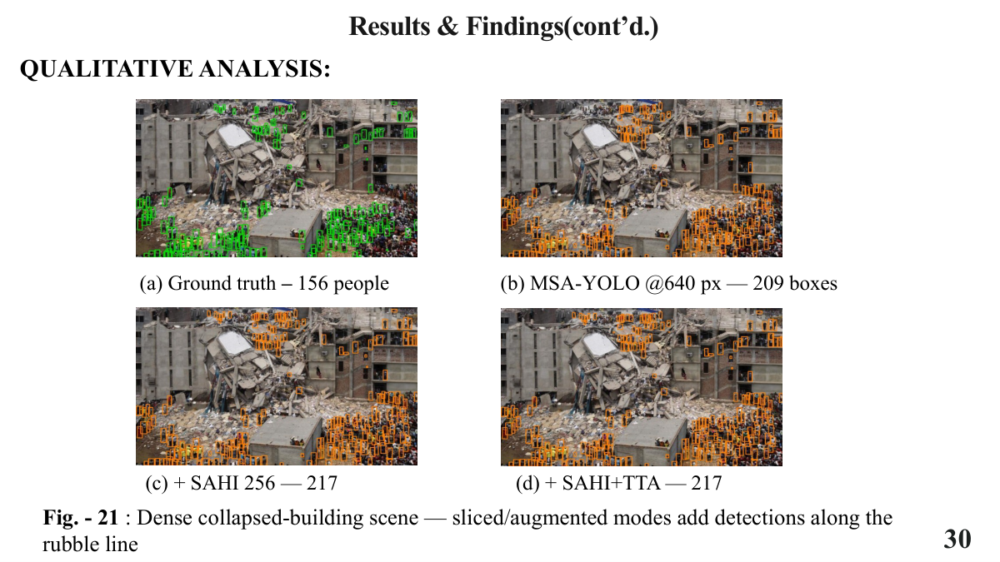

# Defense presentation

**[Open or download the complete presentation PDF](defense-presentation.pdf)** · 43 pages · original archived deck

The presentation explains the architectural ablation, attention, the stride-4 P2 branch, and the exploratory inference study. The PDF here is byte-identical to both the presentation source and the submission-archive copy. Its small embedded XML attachments contain equation markup, not the training implementation.

## How to read it alongside the completed study

The deck represents the earlier defense stage. Read the [current research summary](../README.md) and [full thesis](../documents/thesis.pdf) for the later scene-disjoint audit, three-seed assignment experiment, and supervised real-domain adaptation.

| Original PDF page | Context when reading today |
|---|---|
| 14–20 | Architectural explanation of CBAM and the added P2 detection scale |
| 22 and 32 | Archived SAHI/TTA study; its checkpoint and per-image matching protocol differ from the final-model headline evaluations |
| 25 and 35 | Statements that real-domain transfer is future work are historical; the completed study now reports held-out real-domain adaptation |
| 26–28 | Official-split architectural results; retain the official/scene-disjoint distinction |
| 29 | Low aggregate ECE does not by itself establish trustworthy individual scores or deployment reliability; optimal thresholds also differ by model |
| 30 | Qualitative inference-study example; the final thesis identifies the exploratory Mamba+CBAM+P2 checkpoint |
| 31 | The displayed AP50 values, about 0.893 versus 0.853, imply a gap of about **4 percentage points**, not the slide's prose claim of one point. Its ranking language is historical, not an updated literature survey. |
| 33 | Defense demo; the included drone clips belong to this earlier demonstration, not the later `d3_all` benchmark |

Page references above are **PDF page positions**, because the deck's printed slide numbers are not consecutive. Page 43 contains an image-only diagram of the explored Mamba variant; it is not the retained architecture. The source deck has been preserved without silently rewriting its historical claims.

## Selected slides

### Overall pipeline — PDF page 14

### P2 construction — PDF page 18

### Architectural ablation — PDF page 26

### Size-dependent recall — PDF page 28

### Exploratory qualitative comparison — PDF page 30

The editable PPTX remains in the professor handover. It is approximately 94.7 MiB and contains two embedded videos; this companion uses the complete PDF and separately playable drone clips to keep the download compact.
